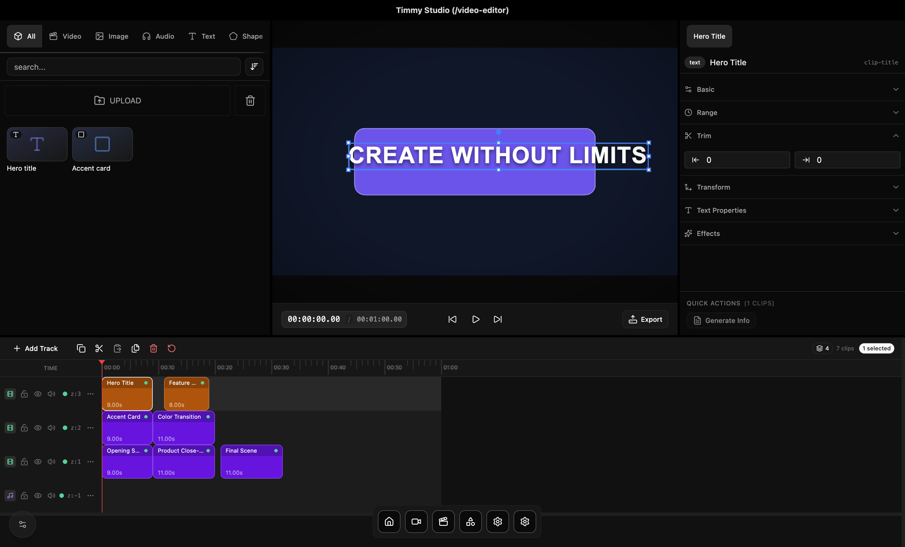

<div align="center">

[English](./README.md) | [한국어](./README.ko.md)


# Timmy Studio

Local desktop video editor.

</div>

## Preview



## Current

- A multitrack timeline for video, audio, images, text, and shapes
- A PixiJS preview with direct transform controls
- Waveforms, filmstrips, proxies, autosave, and FFmpeg export
- Frame rendering and seeking experiments

## Environment

- macOS
- Node.js 22
- pnpm 10
- FFmpeg and helper binaries in `apps/desktop/extra-resources`

## Commands

```bash
pnpm install
pnpm dev
```

```bash
pnpm build
pnpm --filter ./apps/desktop test
```

## Notes

- [Development notes](./DEVELOPMENT.md)
- [Editor rendering pipeline](./docs/editor-rendering-pipeline.md)
- [Studio state refactor](./apps/desktop/renderer/REFACTORING.md)
- Studio code: `apps/desktop/renderer/src/lib/studio`
